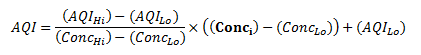

# esp32_ozone
Use a DFRobot Ozone sensor and an ESP32 arduino module to monitor ozone levels.

Why an [ESP32?](https://docs.espressif.com/projects/arduino-esp32/en/latest/getting_started.html)  Because the [InfluxDB](https://www.influxdata.com/) module that this requires IS ONLY SUPPORTED ON ESP32 and ESP8266 chipsets.  Which is fine, there are 43,893,857,923,485 implementations of them, most are cheap.

I wrote this to help [nitrogen76](https://github.com/nitrogen76/cheapWeather) to make a very simple arduino thing to monitor ozone concentration for his project.

If you want to use this, you need an influxDB instance (version 2 is how this is configured, but v1 should be easily portable) and set your influxDB details in the arduino_secrets.h file.

The sensor I am using is [this one](https://www.dfrobot.com/product-2005.html) from [DFRobot](https://www.dfrobot.com)

IT's very important that you let it "cook" for 24 hours before using any measurements from it, and the first 15min of data you get from it after an initial power-up will be weird and not reliable.

Ozone sensors are touchy, especially cheaper ones like this.  The way most governmental orgs that measure ozone do it, is by averaging the level over either 1 hour or 8 hours.

It's also best to keep it protected from wind and direct sunlight, so keeping it in a sensor box is a good idea. 

A good cheap, easy to do sensor box is [this one](https://www.youtube.com/watch?v=qbYXinada-c) i found that a group in the Netherlands uses.  We're testing this one to see how well it works.

The EPA measures ozone as the maximum of an 8 hour average from 07:00-23:00 local time, and converts 
In the United States, Ozone concentration is usually reported in a vague "AQI", using the formula here:

More info on the convulated EPA process is located [here](https://forum.airnowtech.org/t/aqi-calculations-overview-ozone-pm2-5-and-pm10/168)
